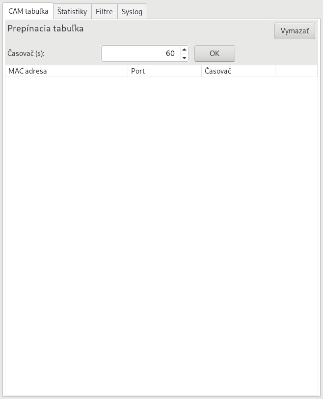
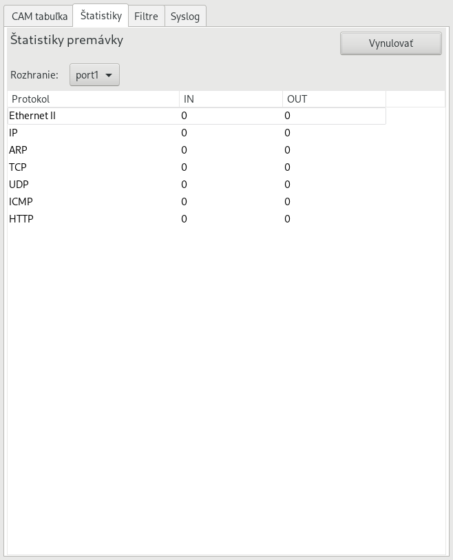
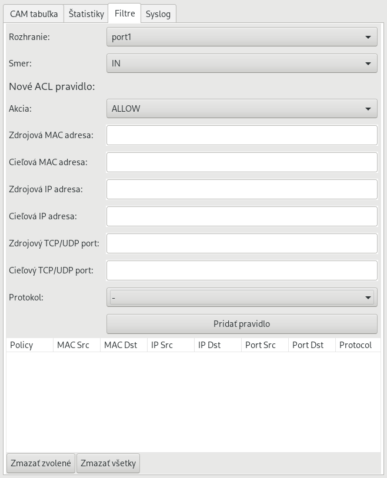
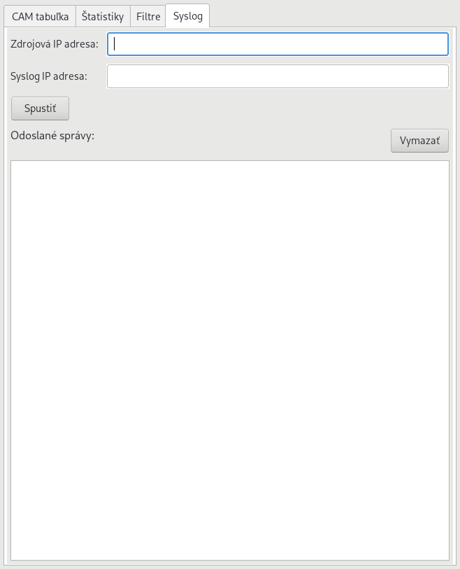

# Multilayer Software Switch
Semestral project, Switching and Routing in IP networks (Summer semester 2021/22), Faculty of Informatics and Information Technologies STU in Bratislava.

## Requirements
- **Switching table** with entries containing: *MAC address, port number, current timer*, and button to clear switching table.
- **Statistical information for RM OSI layers** 2 - 4 on the number of (received/sent)
PDUs on each port in both IN and OUT directions.
- Statistics about PDUs of type Ethernet II, ARP, IP, TCP, UDP, ICMP, HTTP. Allow to reset statistical information.
- **List of filtering rules** evaluated sequentially on the 2nd - 4th layers of RM OSI, including the ports of the transport layer and types of ICMP messages.
- **Syslog client** with:
	- at least 3 levels of message importance (severity level).
	- configurable source IP address and remote Syslog server IP address
	- at least 5 activities (descriptions) recorded using Syslog

## Design
Switch is written in C++11 with PcapPlusPlus 21.11 library (libpcap 1.10.1). Graphicuser interface is provided by the wxWidgets 3.0.5.

### Compile and run

Compile with g++ compiler and substitute correct library paths:

```bash
g++ -std=c++11 -O2 -Wall switch.cpp ‘wx-config --cxxflags --libs‘ \
-lPcap++ -lPacket++ -lCommon++ -lpcap -lpthread \
-I/usr/local/include/pcapplusplus -o switch
```
 
Two loopback interfaces `port1` and `port2` must be in the UP state:

```bash
ip link add name port1 type dummy
ip link add name port2 type dummy
ip link set port1 up
ip link set port2 up
```

Switch can be tested in GNS3 environment.

### User interface








